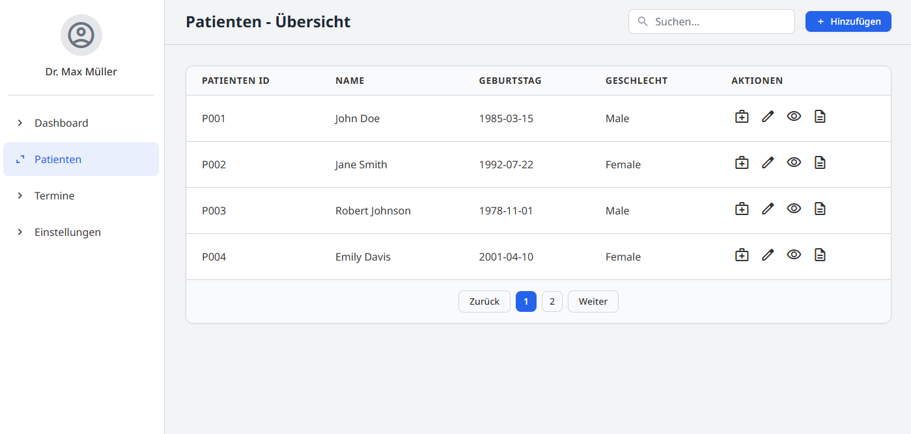
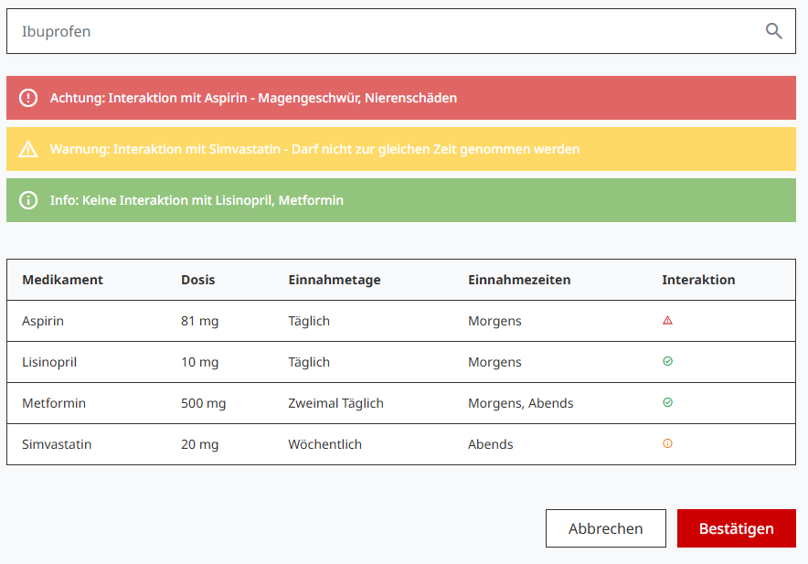
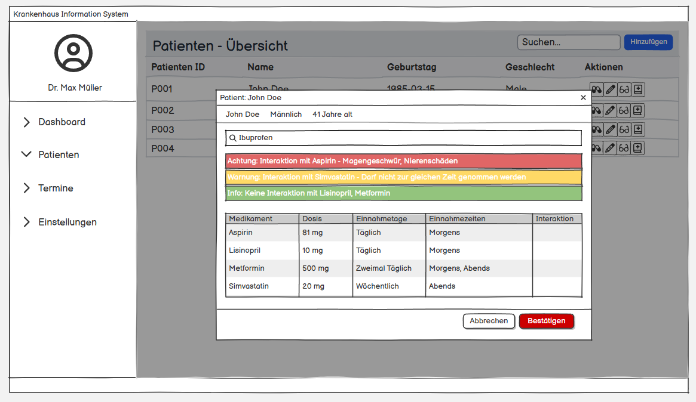
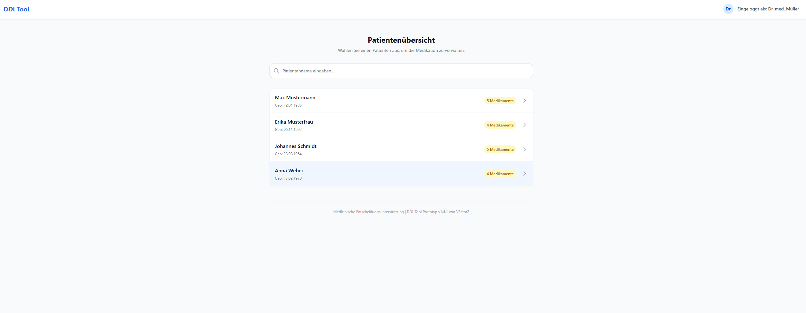
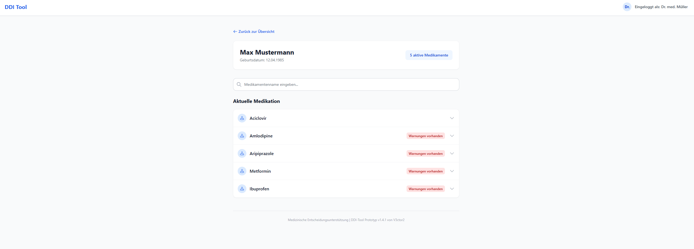
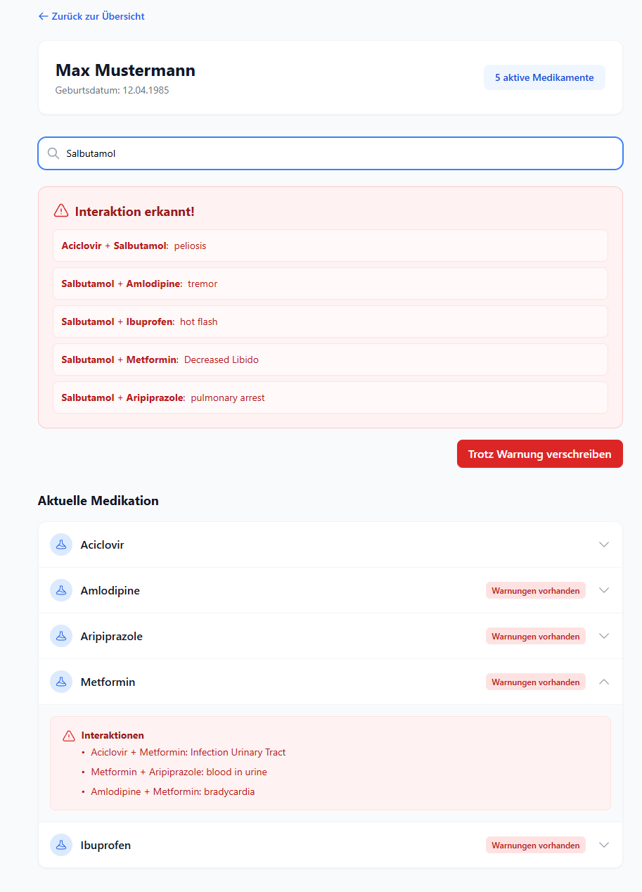

# Drug-Drug Interaction Tool

## Github Repository

Im folgenden Repository finden Sie das Projekt, siehe Projekt README.md für das Starten des Programmes.

[DDI-Tool](https://github.com/chbo70/ddi-tool)

## Übersicht der Datenquellen

Wir haben uns zu Beginn alle Datenquellen aus der Publikation Ayvaz et al.[^1] mal angeschaut. Einige Quellen waren nur schwer zu erreichen und der Download war hinter einer Registrierung versteckt. Viele der Quellen waren auch ähnlich, zu der in Ihrer mitgelieferten CSV-Datein. Daher haben wir uns entschieden ein Skript zu schreiben, um das File in eine SQL Datenbank zu importieren.

Nicht alle der angeführten Datenqullen haben das gleiche Format, manche sind auch unvollständig und fehlerhaft. Es gibt zwei Arten wie die Daten angeführt werden. Einmal wird die DDI mit einem Label beschrieben und zum anderen mit einer Wahrscheinlichkeit und einer Krankheit. Daher haben wir uns dafür entschieden, zwei Tabellen zu erstellen. Die eine beinhaltet nur die Daten von Twosides, während die zweite alle restlichen Einträge zusammenfässt.

## Generelle Überlegungen

### Was macht das ideale DDI Tool aus?

Das ideale Tool ist präzise, kontextsensitiv und handlungsorientiert. Wichtig ist die evidenzbasierte Datenbasis, sprich die Nutzung von verlässlichen, up-to-date Datenbanken. Für ein ideales Tool wäre Kontextbewusstsein auch praktisch. Zum Beispiel werden Patientendaten miteinbezogen, da eine Interaktion, die für einen 25-Jährigen harmlos ist, für eine 85-Jährige fatal sein kann. In diesem Scope würde das aber den Rahemn sprengen. Die Analyse muss in Echtzeit während der Eingabe passieren, ohne den Workflow zu unterbrechen. Was bei großen Datenmenge eine Herausforderung ist. In unserem Fall würden wir nach der Eingabe eines Medikamentes schon mal ein Teil der Daten fetchen, um anschließend in einer kleineren Menge suchen zu können.

### Wie kann Alert Fatigue vermieden werden, ohne wirklich wichtige Alerts unter den Tisch fallen zu lassen?

Ein leicht zu identifzierendes Farbschema, um darauf hinzudeuten wie wichtig es wäre die Nachricht zu lesen. Zum Beispiel rot für kritische Situationen, gelb für Anpassungen die nicht direkte Intervention benötigen und grün für Informationen. In diesem Fall simplifiziert mit grün und rot, basierend auf wie die Interaktion von Medikamenten ist. Man könnte auch hier wieder Kontextbasiert Alerts herauf- oder abstufen je nach zB Laborparametern des Patienten.

### Wie können Benutzer möglichst motiviert werden, solche Tools sinnvoll zu verwenden?

Tools, die nur zusätzliche Arbeit machen werden immer abgelehnt und nur rekulant genutzt. Die Motivation entsteht durch Mehrwert und Reibungslosigkeit. Es bringt nichts wenn man lang auf eine Antwort wartet, oder wenn man vor lauter Information nicht weiß worauf es jetzt wirklich ankommt. Gamification & Statistik sind auch ein Punkt, welche die Motivation etwas zu benutzen erhöhen kann. Zum Beispiel "Facts of the Day" oder eine Auswertung wie "Dank des Tools wurden diesen Monat 12 potenziell schwere Medikationsfehler verhindert" geben auch einen Anreiz diese öfters zu benutzen.

### Für welche Personengruppen sollen solche Tools verfügbar gemacht werden, und wie?

Die Hauptzielgruppe sind Ärzte und PflegerInnen. So ein Tool soll am besten vollintegiert in ein KIS oder die Praxissoftware sein, wo Medikamente von PatientInnen verwaltet werden. So sehen andere Ärzte oder PflegerInnen, ob es eine gefährdende Interaktion gibt und die Benutzung is reibungslos ohne großen Mehraufwand.

### Welche Recommendations sollte ein solches Tool machen?

Das Tool muss konstruktive Vorschläge machen, neben Alerts die einfach nur warnen. Zum Beispiel können alternative Medikamente vorgeschlagen werden, die Dosierung kann angepasst werden um gewisse Stoffe zu hemmen oder die Medikamente können evtl. zu unterschiedlichen Zeiten eingenommen werden.

### Wie würde das Tools am besten verfügbar gemacht?

API-Service der in bestehende Systeme integriert werden kann. Ärzte wechseln ungern die Anwendung. Wenn sie für den Check eine separate Website oder App öffnen müssen, werden sie das im stressigen Alltag wahrscheinlich nicht tun. Das Tool muss dort sein, wo auch der Rest stattfindet. Als Standalone kann auch eine Web-App gemacht werden, die an der gleichen API andockt. So wie wir das auch machen werden.

## Design Mock-Up

## Erklärung der Usability-Aspekte

DISCLAIMER: Die Ideen wurden nicht 1:1 wie unten genannt umgesetzt. Es wurde nur ein einfacher Prototyp erstellt, welcher lediglich die Drug-Drug Interaction zwischen einer Medikamentenliste und einem neu zu hinzufügenden Medikament, aus der Sicht eines schon angemeldeten Arzt, beinhaltet.

### Effizienz
Der wichtigste Punkt für Ärzte was Benutzerfreundlichkeit angeht ist der zeitliche Aufwand, um an die Kernfunktion des Tools zu kommen. Daher die Idee, dass das Tool hauptsächlich ein API ist, um sie möglichst einfach in schon ein bestehendes System integrieren zu können. So ist der Arzt direkt angemeldet und kann aus der Patientenansicht direkt auf das Tool zugreifen, wo auch andere Daten wie die Medikation schon als Parameter bereitstehen und nicht extra angefordert müssen. Idealerweise gibt es in der Medikamentenliste vom Patienten ein zusätzliches Feld "Interaktion", bei dem auf evtl. vorhandene Interaktionen hingewiesen wird. Die Suchfunktion hat eine Autovervollständigung von Medikamenten Namen, um eine schnellere und fehlerfrei Eingabe zu gewährleisten.

### Risikominimierung
Im medizinischen Kontext sind Fehler und Risiko ein wichtiger Aspekt. Wenn eine Interaktion erkannt wird, darf dies nicht untergehen. Daher haben wir uns für ein Ampelsystem Farbschema entschieden:
- Grün: Keine bekannten Wechselwirkungen
- Orange: Vorsicht geboten, z.B. Dosisanpassung nötig
- Rot: Gefährliche Wechselwirkung, das hinzufügen erfordert eine explizite Bestätigung

Durch die Autovervollständigung werden Tippfehler reduziert und durch das Anzeigen von Interaktionen in der Medikamentenliste, sieht der Arzt sofort, ob es bereits Komplikationen gibt.

### Erlernbarkeit und Übersichtlichkeit
Das System sollte sich intuitiv von selbst erklären, ohne dass die Ärzte Anleitungen lesen müssen. Durch die Integration in schon ein für den Arzt bekanntes System ermöglicht einen leichten Einstieg. Die Nutzung eines Pop-up-Fenster für die Suche ist intuitiv verständlich und der Arzt verliert dadurch nicht den Kontext zum darunterliegenden Patientenprofil. Ein schlichtes Design mit deutlichen und farblichen Inputs verhindert Verwirrung. Eindeutiges Feedback durch Notification-Banner zeigen dem Arzt direkt, welche Auswirkungen seine Eingaben haben.

### Erweiterungen
Durch einen Kategorie-Prefilter & Alternativ-Vorschläge kann der Arzt entlastet werden. Zum Beispiel wenn Medikament A eine Wechselwirkung hat, denkt die App mit und schlägt direkt Medikament B aus derselben Kategorie vor und der Arzt spart sich erneutes Recherchieren. Durch das Hinzufügen von der Dosis eine Medikamentes könnten auch smartere Entscheidungen und akkuratere Warnungen erstellt werden. Beides setzt eine Erweiterung des Datensets voraus.

### Prototyp

## Arbeitsaufteilung

- Niklas Kasper, 12122377: 
    - Datenaufbereitung, Datenbereinigen
    - init_database.py und Backend Schnittstellen
    - Wireframes & Design Mockup 
    - Dokumentation
- Boon-Chung Chi, 12118081: 
    - Frontend des Protoypem
    - Schnittstellen im Frontend 
    - Erweiterung der backend Schnittstellen
    - Tech Stack initialisierung

[^1]: https://doi.org/10.1016/j.jbi.2015.04.006
